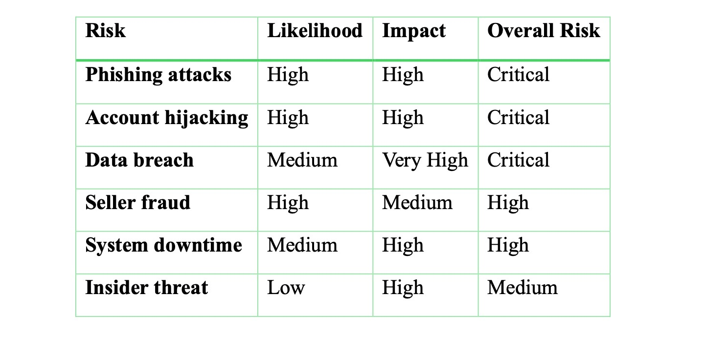
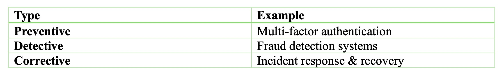
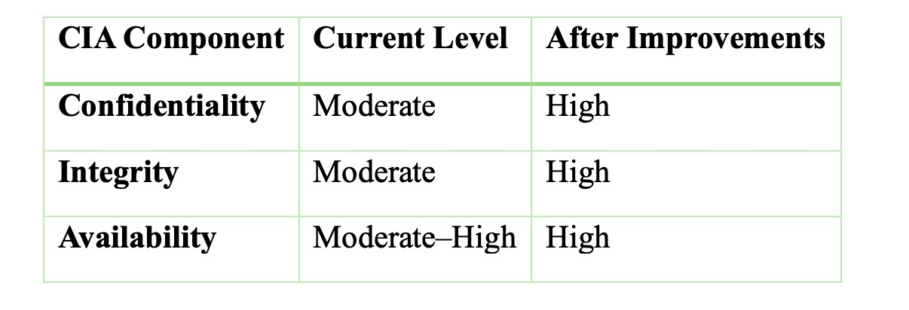

# Noon Cybersecurity Analysis

A cybersecurity analysis of the **Noon e-commerce platform in Saudi Arabia**, completed as part of the **CYS403** course.

This academic project evaluates Noon's cybersecurity posture from a risk-management and governance perspective. It focuses on security threats, risk assessment, authentication, data confidentiality, security controls, Saudi cybersecurity frameworks, and proposed security improvements.

## Project Overview

Large e-commerce platforms process sensitive customer, payment, transactional, and business information. This creates cybersecurity risks involving account compromise, fraud, phishing, data breaches, service disruption, and third-party exposure.

This project analyzes Noon as a large-scale e-commerce information system and evaluates its current security situation, major cybersecurity risks, existing security measures, and potential security improvements.

## Main Areas of Analysis

The project covered:

- Current security situation
- Existing security measures
- Cybersecurity risk identification and assessment
- Human-factor and user-behavior risks
- Risk classification and evaluation
- Risk-control techniques
- Authentication mechanisms
- Data confidentiality
- Security policies and guidelines
- Saudi cybersecurity frameworks
- CIA Triad analysis
- Proposed security improvements

## Cybersecurity Risk Assessment

The project identified and evaluated several cybersecurity risks based on their **likelihood and potential impact**.

Key risks analyzed included:

- Phishing and social engineering
- Account hijacking and unauthorized access
- Data breaches
- Seller fraud
- System downtime
- Insider threats
- Payment-related risks

The following table summarizes the risk evaluation performed in the project:

The assessment identified **phishing attacks, account hijacking, and data breaches** among the most critical risks considered in the analysis.

## Risk Management

The project examined cybersecurity risk management by considering the likelihood and impact of identified threats and selecting appropriate approaches for managing them.

Risks were also considered across major information-system components, including:

- Hardware
- Software
- Data
- People
- Procedures
- Networks

## Security Controls

The analysis considered different security-control approaches for reducing cybersecurity risk.

Examples include:

These controls can be categorized as:

- **Preventive controls** – designed to prevent security incidents before they occur
- **Detective controls** – designed to identify suspicious or malicious activity
- **Corrective controls** – designed to respond to incidents and support recovery

Examples discussed in the project include multi-factor authentication, fraud detection systems, and incident response and recovery.

## Authentication & Data Confidentiality

The project evaluated authentication mechanisms such as:

- Username and password authentication
- One-Time Password (OTP) verification
- Session management

The analysis also considered authentication limitations and risks, including:

- Password reuse and weak password practices
- Phishing attacks
- Reliance on SMS-based OTP
- Lack of stronger mandatory Multi-Factor Authentication (MFA)

Data confidentiality was evaluated through security measures such as encryption, secure communication, access control, and protection of sensitive customer information.

## Saudi Cybersecurity & Compliance Context

The project considered cybersecurity practices within the Saudi regulatory environment, including:

- National Cybersecurity Authority (NCA) cybersecurity guidance
- Personal Data Protection Law (PDPL)
- Data-protection principles
- Security and privacy requirements

This helped connect the cybersecurity assessment with the broader governance and regulatory environment in Saudi Arabia.

## Proposed Security Improvements

Based on the analysis, several potential security improvements were proposed, including:

- Stronger Multi-Factor Authentication (MFA)
- Biometric or authenticator-based authentication
- Zero Trust Architecture (ZTA)
- Least-privilege access
- Micro-segmentation
- Real-time logging and alerting
- AI-based fraud detection
- Behavioral analytics
- Stronger seller verification and monitoring
- Improved cybersecurity awareness

## CIA Triad Analysis

The project evaluated the platform using the three fundamental cybersecurity principles of the **CIA Triad: Confidentiality, Integrity, and Availability**.

### Confidentiality

Focuses on protecting customer, payment, account, and business information from unauthorized disclosure.

### Integrity

Focuses on protecting transactions, accounts, and marketplace information from unauthorized modification or manipulation.

### Availability

Focuses on maintaining reliable access to platform services and minimizing disruption or downtime.

The analysis also considered how the proposed security improvements could strengthen each component of the CIA Triad.

## Skills & Concepts Demonstrated

- Cybersecurity Risk Assessment
- Risk Management
- CIA Triad
- Authentication Security
- Data Confidentiality
- Security Controls
- Security Policies
- Security Governance
- Multi-Factor Authentication (MFA)
- Zero Trust Architecture (ZTA)
- Threat Analysis
- NCA Cybersecurity Frameworks
- PDPL Awareness
- Security Awareness
- E-commerce Security

## Full Project Report

The complete CYS403 cybersecurity analysis, including the risk assessment, security controls, authentication evaluation, proposed improvements, and CIA Triad analysis, is available here:

[View the Full Cybersecurity Analysis Report](CYS403-Noon-Cybersecurity-Analysis.pdf)

## Academic Project

This project was completed by a team of three Computer Science students as part of the **CYS403** course.

## Disclaimer

This repository contains an **academic cybersecurity analysis based on publicly available information**. It is not an internal security assessment of Noon and does not claim access to Noon's private systems, infrastructure, source code, or confidential security controls.
